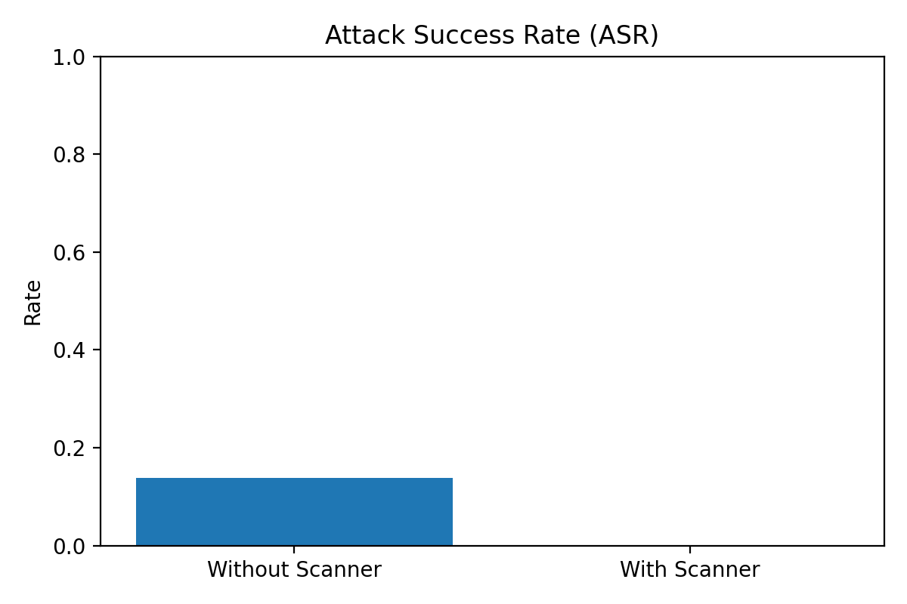
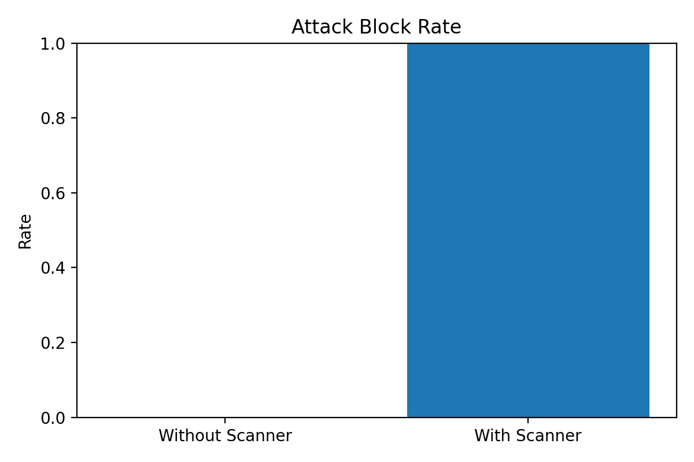

# LLM-Code-Attack-Scanner

**Course**: CS4371/5378 – Computer Security  
**Paper**: Security Attacks on LLM-based Code Completion Tools  
**Link**: https://arxiv.org/pdf/2408.11006

## Quick Start (For Instructors / Anyone Cloning)

### 1) Clone repository

```bash
git clone <YOUR_PUBLIC_REPO_URL>
cd LLM-Code-Attack-Scanner-
```

### 2) Create and activate virtual environment

```bash
py -m venv .venv
.venv\Scripts\activate
```

### 3) Install dependencies

```bash
py -m pip install -r requirements.txt
```

### 4) Install and test Ollama (required for LLM evaluation)

Install Ollama: [https://ollama.com/download](https://ollama.com/download)

```bash
ollama pull qwen2.5-coder:1.5b
ollama run qwen2.5-coder:1.5b "hello"
```

### 5) Run full project (recommended)

```bash
py run_all.py
```

This will:
- run scanner evaluation (`pipeline.py`)
- run LLM defense evaluation (`evaluation_llm.py`)
- generate plots (`plot_results.py`)

### 6) Check generated outputs

- `results/latest_metrics.json`
- `results/asr.png`
- `results/block_rate.png`

If `py run_all.py` is too slow, run each script separately:

```bash
py pipeline.py
py evaluation_llm.py
py plot_results.py
```

## Submission Checklist

- Submit the **public GitHub repository URL** for grading.
- Codebase includes commented, readable Python scripts for scanner, evaluation, and plotting.
- All dataset files needed to reproduce results are included in `attacks/` and `safe/`.

## Project Description

We are reproducing the **Level II Code Embedded Attack** from the paper and building a simple **scanner** to detect hidden prompt injections in code.

## Current Status

- Basic lexical scanner implemented (`scanner.py`)
- Added multiple **attack files** to test suspicious embedded prompt patterns
- Added multiple **safe files** to test normal code and possible false positives
- Added `pipeline.py` to scan all test files and print both per-file results and evaluation metrics

## Files

- `scanner.py` → Main scanner that checks for Level II attack patterns
- `pipeline.py` → Runs the scanner on all files in `attacks/` and `safe/`, prints results, and computes evaluation metrics
- `evaluation_llm.py` → Runs end-to-end gating + local Ollama model evaluation and saves `results/latest_metrics.json`
- `plot_results.py` → Plots ASR and attack block rate from `results/latest_metrics.json`
- `run_all.py` → Runs scanner metrics, LLM metrics, and plotting in one command
- `requirements.txt` → Python dependencies for this project
- `attacks/` → Folder containing attack example files
- `safe/` → Folder containing safe example files

## Dataset Structure

Organize the files like this:

```text
project/
│── scanner.py
│── pipeline.py
│── attacks/
│   ├── attack_comment.py
│   ├── attack_concat.py
│   ├── attack_name.py
│   └── ...
│── safe/
│   ├── safe_math.py
│   ├── safe_loop.py
│   └── ...
```
All files inside:
- `attacks/` are treated as true label = `ATTACK`
- `safe/` are treated as true label = `SAFE`

## Clone and Setup

```bash
git clone <YOUR_PUBLIC_REPO_URL>
cd LLM-Code-Attack-Scanner-
py -m venv .venv
.venv\Scripts\activate
py -m pip install --upgrade pip
py -m pip install -r requirements.txt
```

### Ollama Setup (required for LLM evaluation)

Install Ollama from [https://ollama.com/download](https://ollama.com/download), then:

```bash
ollama pull qwen2.5-coder:1.5b
ollama run qwen2.5-coder:1.5b "hello"
```

## How to Run the Scanner

On Windows, if `python` is not on your PATH, use the **Python Launcher** (`py`):

```bash
# Test an attack file
py scanner.py attacks/attack_concat.py
```

If `python` works on your machine, you can use:

```bash
python scanner.py attacks/attack_concat.py
```

**Expected output example** (for `attack_concat.py`):

```text
ATTACK: Multiple string concatenations detected on line 3 (Level II style)
```

## How to Run the Full Pipeline

To scan every file in the `attacks/` and `safe/` folders and print the evaluation:

```bash
py pipeline.py
```

The pipeline will:
- read every file in `attacks/` and `safe/`
- run `scan_code()` on each file
- print the scanner result for each file
- compare the scanner result with the file’s true label
- print evaluation metrics

## Evaluation Metrics

The pipeline prints:
- **TP (True Positive)**: attack file correctly detected as `ATTACK`
- **TN (True Negative)**: safe file correctly detected as `SAFE`
- **FP (False Positive)**: safe file incorrectly flagged as `ATTACK`
- **FN (False Negative)**: attack file incorrectly missed as `SAFE`
- **Accuracy**
- **Precision**
- **Recall**
- **F1 Score**

These metrics help show how well the scanner performs, not just whether it works on one or two examples.

## LLM Defense Evaluation (Ollama)

This script runs end-to-end gating with local Ollama:
- loads `attacks/` and `safe/`
- optionally blocks prompts using `scan_code()`
- sends allowed prompts to model `qwen2.5-coder:1.5b`
- writes consolidated metrics to `results/latest_metrics.json`

Run:

```bash
py evaluation_llm.py
```

This prints and saves:
- `asr_total` (attack success rate)
- `block_rate_attacks` (attack block rate)
- `false_block_rate_safe` (safe-file false block rate)

## Plotting Results

Generate plots from `results/latest_metrics.json`:

```bash
py plot_results.py
```

This saves:
- `results/asr.png`
- `results/block_rate.png`

You can show them in README:




## One Command Run

To run everything in order (scanner metrics, LLM metrics, plots):

```bash
py run_all.py
```

## What Works / What Does Not

**Works in current final version:**
- Scanner classification over `attacks/` + `safe/` with TP/TN/FP/FN, precision, recall, and F1 (`pipeline.py`).
- End-to-end gated evaluation against a local Ollama model (`evaluation_llm.py`).
- Auto-saved metrics JSON (`results/latest_metrics.json`).
- Auto-generated plots for ASR and attack block rate (`results/asr.png`, `results/block_rate.png`).

**Known limitations:**
- The `is_attack_success` function uses keyword heuristics and is not a full human-judged safety benchmark.
- Runtime depends on local hardware and Ollama model speed.
- This project evaluates static code snippets, not live IDE plugin integrations (e.g., Copilot extension runtime).

## Reproducibility and Test Data

- All evaluation data is included in this repository:
  - `attacks/` contains attack examples.
  - `safe/` contains benign control examples.
- Instructors can reproduce core outputs by running:
  1. `py pipeline.py`
  2. `py evaluation_llm.py`
  3. `py plot_results.py`
  - or all at once with `py run_all.py`.

## Scholarly References

1. **Foundational prior work (bedrock):**  
   Pearce, H., Ahmad, B., Tan, B., et al. (2022). *Asleep at the Keyboard? Assessing the Security of GitHub Copilot’s Code Contributions*. IEEE Symposium on Security and Privacy. [https://arxiv.org/abs/2108.09293](https://arxiv.org/abs/2108.09293)

2. **Contemporary work that cites/builds on current paper:**  
   *A Survey on Trustworthy LLM Agents: Threats and Countermeasures* (2025). [https://arxiv.org/abs/2503.09648](https://arxiv.org/abs/2503.09648)

## Team Roles

| Member | Role |
|--------|------|
| Knowledge Neupane | Scanner development |
| Justin Le Nguyen | Creating more attack examples (20–30 files) |
| Anh Ngoc Nguyen | Ollama + CodeLlama setup + pipeline |
| Anuska Dhital | Evaluation and paper summary |
